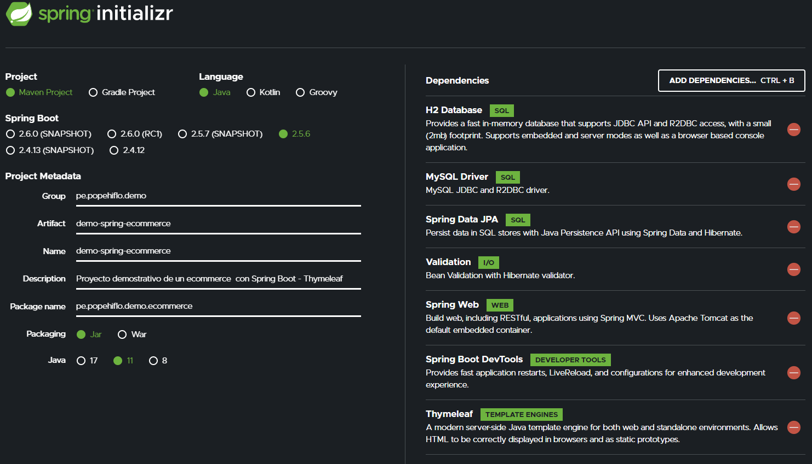

# Ecommerce : Demo Spring ecommerce application 🛒
**Proyecto Web Fullstack**   
`H2`, `MySQL`, `JPA`, `Hibernate`, `Spring Boot`, `Spring Data JPA`, `Spring MVC`, `Spring Security`, `JWT`, `HTML`, `CSS`, `Thymleaf`.  

## Backend Java construido con 🛠️
*API Rest usando Java con Spring Boot 2.5.6 y base de datos H2/MySQL. Uso de JPA con Hibernate para la persistencia de datos. También tiene validación de datos, manejo de excepciones, uso adecuado del protocolo HTTP en estándar REST y mucho más*
* [H2](https://www.h2database.com/html/main.html) - Base de Datoss relacionales hecho con Java SQL
* [MySQL 8](https://dev.mysql.com/downloads/mysql/) - RDBMS de codigo abierto
* [Java 11](https://www.oracle.com/java/technologies/downloads/#java11) - Java SE Development Kit 11
* [Spring](https://spring.io/) - El framework web mas usado
    * [Spring Boot]()
    * [Spring Data JPA]()
    * [Spring MVC]()
    * [Spring Security]()
* [Maven](https://maven.apache.org/) - Manejador de dependencias  

## Inicio - Spring Initialzr 🛠️


## Release - Vista UI 🛠️


## Ejecutando localmente 🚀
Esta es una aplicación [Spring Boot](https://spring.io/guides/gs/spring-boot/) construida usando [Maven](https://spring.io/guides/gs/maven/). Se puede compilar y ejecutar desde la línea de comandos; depues de clonar el repositorio:  
```
cd demo-spring-ecommerce
mvn spring-boot:run
``` 
Segun como lo tenga configurado el path base sera `http://localhost:8080/`  
## Colección de Requests en Postman 📎
Postman: **[Coleccion Request Postman]()**   
## Descripción 💬
API REST que permite el CRUD de la diferentes Enums, entidades aqui listadas:
- [Usuario](src/main/java/pe/popehiflo/demo/ecommerce/model/Usuario.java): ...
- [Producto](src/main/java/pe/popehiflo/demo/ecommerce/model/Producto.java): ...
- [Orden](src/main/java/pe/popehiflo/demo/ecommerce/model/Orden.java): ...
- [DetalleOrden](src/main/java/pe/popehiflo/demo/ecommerce/model/DetalleOrden.java): ...     

## Si encuentra un error o quiere sugerir una mejora 🗨️
Siéntase libre de informar algun problema aquí: 
[https://github.com/popehiflo/demo-spring-ecommerce/issues](https://github.com/popehiflo/demo-spring-ecommerce/issues)
## Licencia 📄
¿Qué es eso? 😆     

         
⌨️ con ❤️ por [popehiflo](https://github.com/popehiflo) 😊
